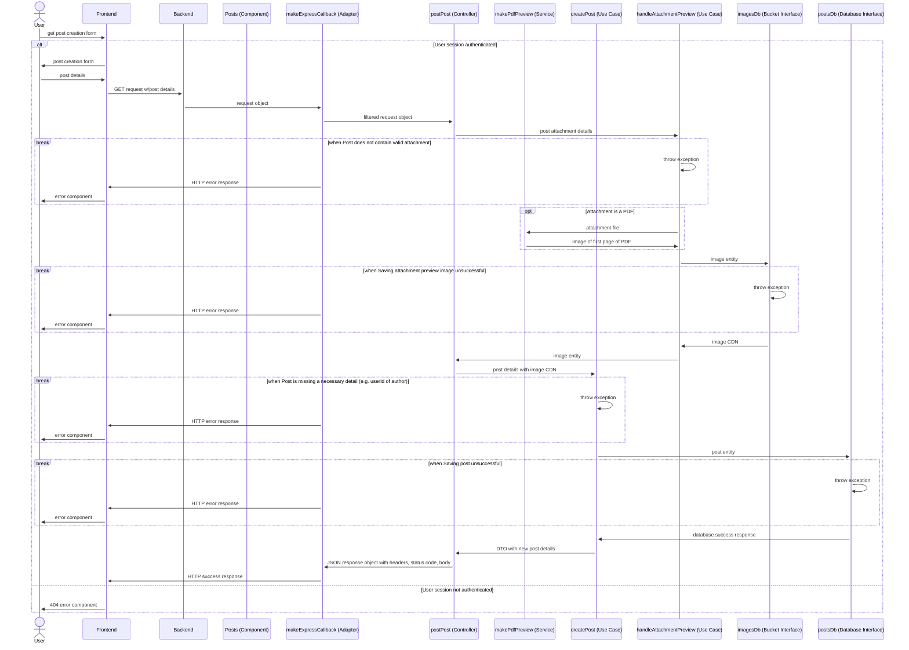

# CV Circle: Documentation

## Backend

Here are some notes on the architecture of CV circle's backend. It's a work in progress! Diagrams are generated with mermaid.js.

### Post Creation Sequence Diagram

This is what occurs when a POST request is made to 'api/posts'. (Swagger documentation to be added here.)

