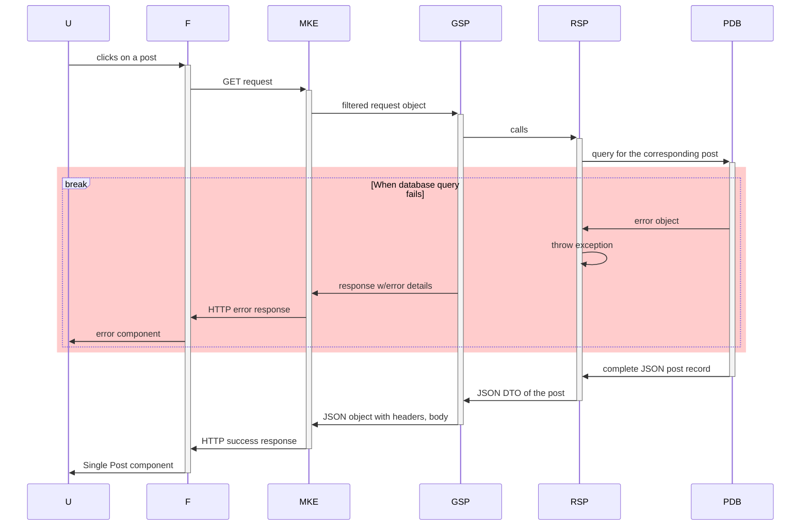
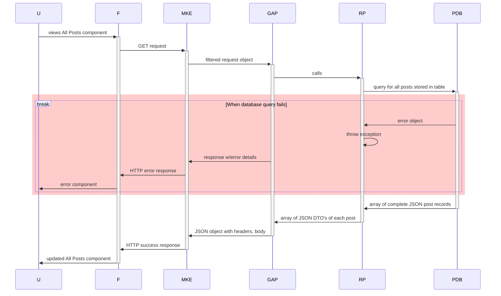
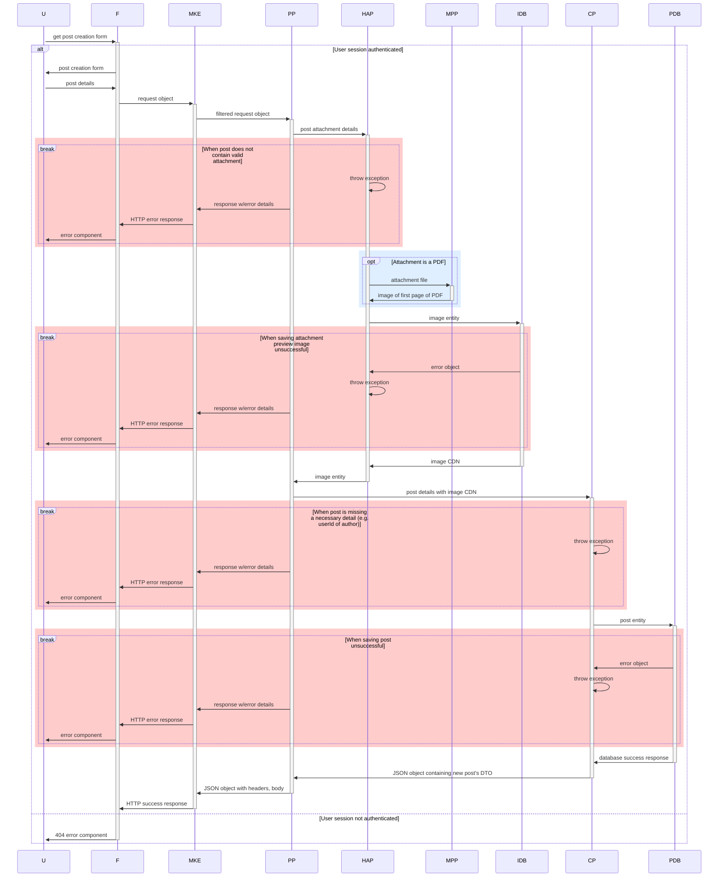
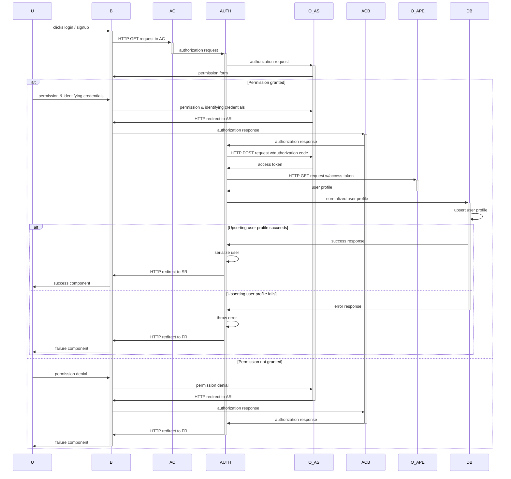

# CV Circle: Documentation

## Backend

Here are some notes on the architecture of CV circle's backend. It's a work in progress! Diagrams are generated with mermaid.js. Swagger documentation to be added soon as well!

- Posts component
  - [GET /api/posts](#get-apiposts)
  - [GET /api/posts/:id](#get-apipostsid)
  - [POST /api/posts](#post-apiposts)
- Users component
  - [GET /api/auth/[provider]](#get-apiauthprovider)

---

### GET /api/posts/:id

When a GET request is made to 'api/posts/:id', a single post is returned if all goes well.

#### Participant Abbreviations

| Full                | Abbreviation | Additional Notes                                                                                               |
| ------------------- | ------------ | -------------------------------------------------------------------------------------------------------------- |
| User                | U            | ----                                                                                                           |
| Frontend            | F            | ----                                                                                                           |
| makeExpressCallback | MKE          | An adapter that provides an extra layer of indirection for req, res variables between frontend and controllers |
| getSinglePost       | GSP          | The controller for the GET endpoint at /api/posts/:id                                                          |
| retrieveSinglePost  | RSP          | The use case for retrieving a single post                                                                      |
| postsDb             | PDB          | Interface for queries against the Supabase table that stores the posts                                         |

---

### GET /api/posts

When a GET request is made to '/api/posts', a list of posts is returned if all goes well.

#### Participant Abbreviations

| Full                | Abbreviation | Additional Notes                                                                                               |
| ------------------- | ------------ | -------------------------------------------------------------------------------------------------------------- |
| User                | U            | ----                                                                                                           |
| Frontend            | F            | ----                                                                                                           |
| makeExpressCallback | MKE          | An adapter that provides an extra layer of indirection for req, res variables between frontend and controllers |
| getAllPosts         | GAP          | The controller for the GET endpoint at /api/posts/                                                             |
| retrievePosts       | RP           | The use case for retrieving all posts                                                                          |
| postsDb             | PDB          | Interface for queries against the Supabase table that stores the posts                                         |

---

### POST /api/posts

When a POST request is made to '/api/posts', a new post is created if all goes well.

#### Participant Abbreviations

| Full                    | Abbreviation | Additional Notes                                                                                               |
| ----------------------- | ------------ | -------------------------------------------------------------------------------------------------------------- |
| User                    | U            | ----                                                                                                           |
| Frontend                | F            | ----                                                                                                           |
| makeExpressCallback     | MKE          | An adapter that provides an extra layer of indirection for req, res variables between frontend and controllers |
| PostPost                | PP           | The controller for the POST endpoint at /api/posts/                                                            |
| handleAttachmentPreview | HAP          | Use case for handling process of generating preview from post attachment                                       |
| createPost              | CP           | Use case for creating post                                                                                     |
| imagesDb                | IDB          | Interface for queries against the Supabase bucket that stores the posts' attachments' images                   |
| postsDb                 | PDB          | Interface for queries against the Supabase table that stores the posts                                         |
| makePdfPreview          | MPP          | A custom service used by HAP to transform the first page of a PDF file into an image                           |

---

### GET /api/auth/[provider]

When a GET request is made to '/api/auth/[provider]', the login / signup process with that provider begins. Current providers are Github and Google.

#### Participant Abbreviations

| Full                        | Abbreviation | Additional Notes                                                               |
| --------------------------- | ------------ | ------------------------------------------------------------------------------ |
| User                        | U            | ----                                                                           |
| Browser                     | B            | ----                                                                           |
| Auth Controller             | AC           | Controller for the first GET endpoint reached in login/signup requests         |
| Auth Callback Controller    | ACB          | Controller for the GET endpoint at the redirect URI in OAuth apps              |
| Authenticator               | AUTH         | The authenticator middleware used - currently, Passport.js                     |
| OAuth Authorization Server  | O_AS         | The OAuth authorization server for the OAuth provider being used (e.g. Google) |
| OAuth API Provider endpoint | O_APE        | The OAuth provider's API endpoint, which serves profile data                   |
| Database                    | DB           | The application database, where users are stored                               |

##### Other notes

URI's are referenced in diagram as follows:
| URI | Abbreviation | Notes |
| :--- | :----------: | -------------: |
| /api/auth/[provider] | AC | Leads to the Auth Controller |
| /api/auth/[provider]/redirect | AR | The authorization redirect URL used in authentication strategies |
| /logged-in | SR | The success redirect URL |
| /login-failed | FR | The failure redirect URL |

