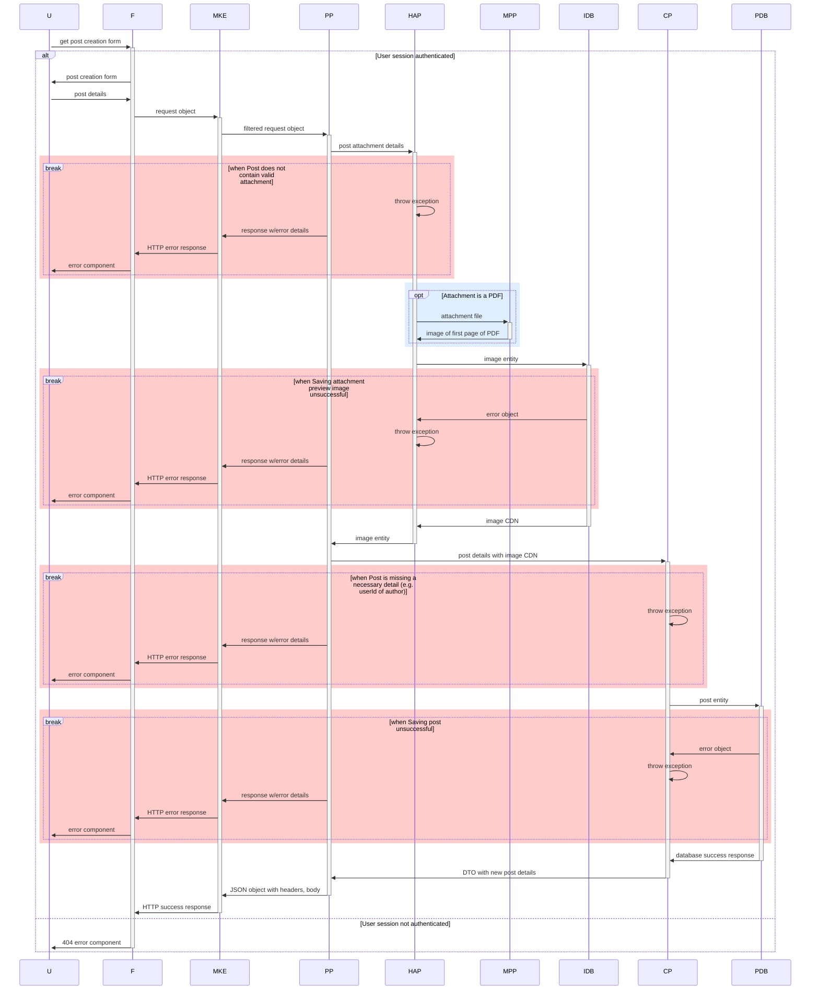

# CV Circle: Documentation

## Backend

Here are some notes on the architecture of CV circle's backend. It's a work in progress! Diagrams are generated with mermaid.js.

- [POST /api/posts](#post-creation-sequence-diagram)

---

### POST /api/posts

When a POST request is made to 'api/posts', a new post is created if all goes well. (Swagger documentation to be added here.)

#### Participant Abbreviations

| Full                    | Abbreviation | Additional Notes                                                                                                                                                                                      |
| ----------------------- | ------------ | ----------------------------------------------------------------------------------------------------------------------------------------------------------------------------------------------------- |
| User                    | U            | ----                                                                                                                                                                                                  |
| Frontend                | F            | ----                                                                                                                                                                                                  |
| makeExpressCallback     | MKE          | An adapter that provides an extra layer of indirection for dealing with req, res variables - passes on filtered req objects to controllers and constructs res objects from the controllers' responses |
| PostPost                | PP           | The controller for the POST endpoint at /api/posts/                                                                                                                                                   |
| handleAttachmentPreview | HAP          | Use case for handling process of generating preview from post attachment                                                                                                                              |
| createPost              | CP           | Use case for creating post                                                                                                                                                                            |
| imagesDb                | IDB          | Interface for queries against the Supabase bucket that stores the posts' attachments' images                                                                                                          |
| postsDb                 | PDB          | Interface for queries against the Supabase table that stores the posts                                                                                                                                |
| makePdfPreview          | MPP          | A custom service used by HAP to transform the first page of a PDF file into an image                                                                                                                  |

