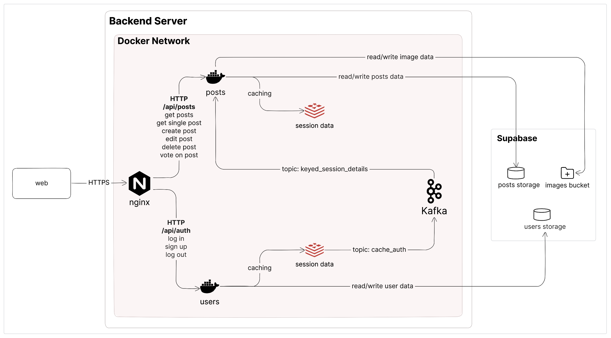

<p><a target="_blank" href="https://app.eraser.io/workspace/eI5y2LS9WNWkJZPiNXvt" id="edit-in-eraser-github-link"></a></p>

# CV Circle

This web app allows users to exchange resumes and cover letters and receive feedback on them from others!


_Made with Eraser_

## Technologies used

**Frontend**

- React
- React Query - client-side caching to reduce server requests
- TailwindCSS

  **Backend**

- ExpressJS - NodeJS framework for building lightweight servers
- Kafka - event streams to synchronize information across microservices while keeping them loosely coupled
- Redis - caching for backend microservices
- Nginx - reverse proxy for backend microservices
- Docker - containerizing services
- Vitest - testing services
- Passport.js - OAuth authentication handling
- Supabase - hosted PostgreSQL database

## Design Decisions

Throughout creating this project, I tried to make thoughtful design & architectural choices. For the backend, I used domain-driven design, so it is split by feature ("posts" and "users" in this case). Additionally, I implemented clean architecture principles as much as possible. The modules in each feature use parameter-based dependency injection and implement inversion of control. This also enables increased flexibility in unit tests.

On the frontend, too, I organized the components by domain. I also used industry-standard technology like React Query for client-side caching, and React Suspense for asynchronous operation management.

## Video Demonstration

Coming soon! Head over to [CV Circle](https://www.cv-circle.onrender.com) to try the app for yourself.

## License

```
Copyright 2023 Maryam Khan

Licensed under the Apache License, Version 2.0 (the "License");
you may not use this file except in compliance with the License.
You may obtain a copy of the License at

    http://www.apache.org/licenses/LICENSE-2.0

Unless required by applicable law or agreed to in writing, software
distributed under the License is distributed on an "AS IS" BASIS,
WITHOUT WARRANTIES OR CONDITIONS OF ANY KIND, either express or implied.
See the License for the specific language governing permissions and
limitations under the License.
```

<!--- Eraser file: https://app.eraser.io/workspace/eI5y2LS9WNWkJZPiNXvt --->
