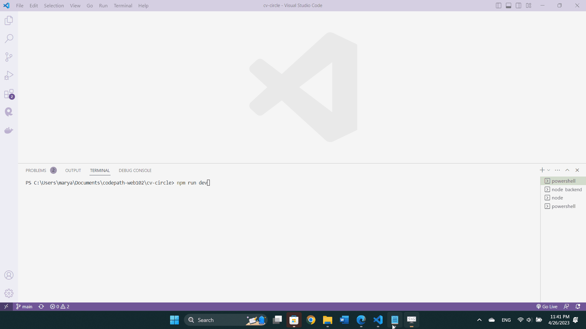

<p><a target="_blank" href="https://app.eraser.io/workspace/eI5y2LS9WNWkJZPiNXvt" id="edit-in-eraser-github-link"></a></p>

# CV Circle
This web app allows users to exchange resumes and cover letters and receive feedback on them from others!


## Video Walkthrough
Here's a walkthrough of implemented user stories:



GIF created with ScreenToGif

## Notes
Describe any challenges encountered while building the app.

## License
```
Copyright 2023 Maryam Khan

Licensed under the Apache License, Version 2.0 (the "License");
you may not use this file except in compliance with the License.
You may obtain a copy of the License at

    http://www.apache.org/licenses/LICENSE-2.0

Unless required by applicable law or agreed to in writing, software
distributed under the License is distributed on an "AS IS" BASIS,
WITHOUT WARRANTIES OR CONDITIONS OF ANY KIND, either express or implied.
See the License for the specific language governing permissions and
limitations under the License.
```


<!--- Eraser file: https://app.eraser.io/workspace/eI5y2LS9WNWkJZPiNXvt --->
